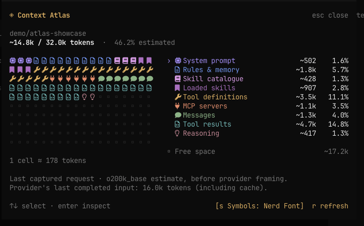
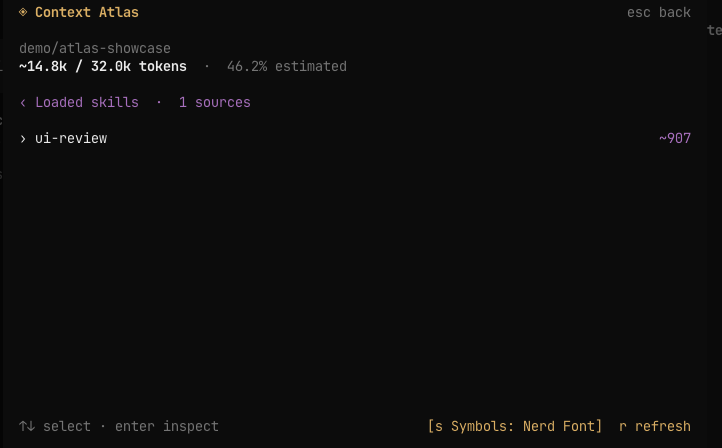
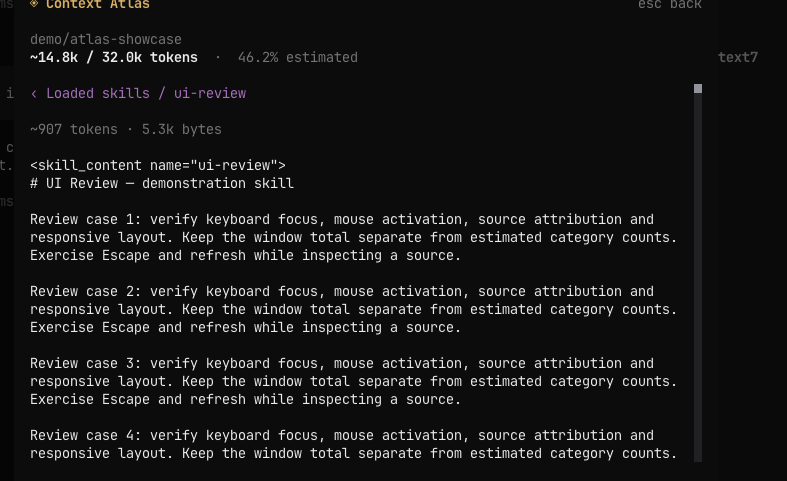
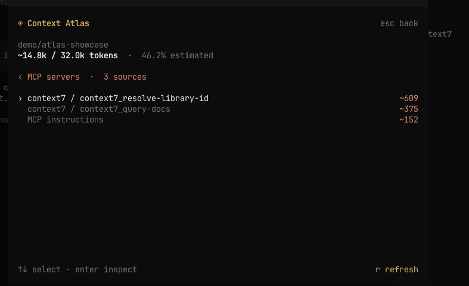
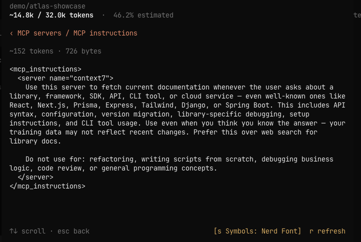
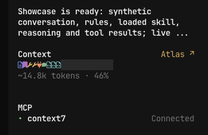
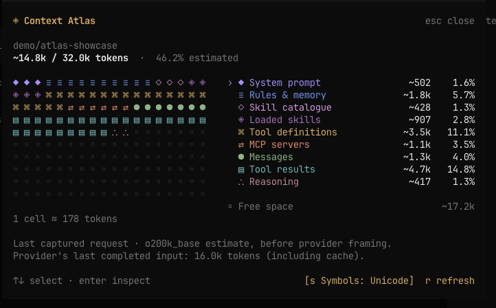
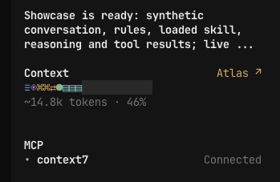
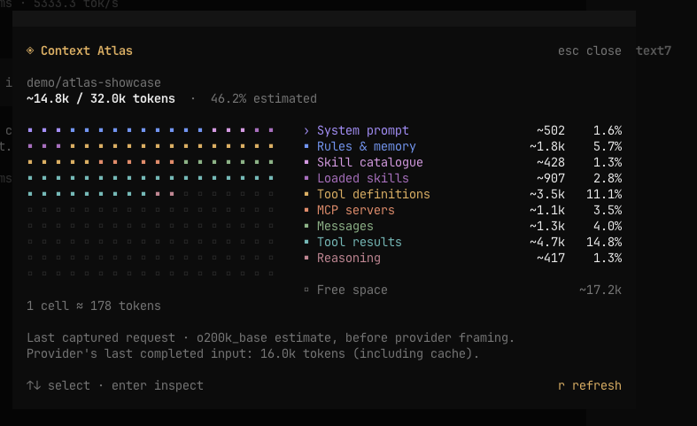
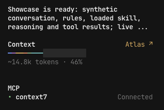

# Context Atlas

A Claude Code-inspired **context map for OpenCode v2**. See what occupies your
context window, then drill into the actual rules, skills, tool definitions and
messages behind the numbers.



**Nerd Font icons are the default.** Select a Nerd Font Mono in your terminal,
or use the **Symbols** button / **`s`** to switch to Unicode or plain blocks.

<details>
<summary>Inspect loaded skills and MCP sources</summary>

These are native terminal screenshots from OpenCode 2.0.22. Context7 is connected
to its live MCP server; the conversation, rules, loaded skill and provider usage
are illustrative demo data.

### Loaded skills



### Skill contents



### MCP sources



### MCP instructions



</details>

## Open it

- **`/context`**, or **`/atlas`** — open the inspector for the current session.
- **Click `Atlas ↗`** in the sidebar — open the same inspector.
- Click a colored cell or a category, or use **↑/↓ and Enter**, to inspect its sources.
- Select a source to read its captured text. **Esc** goes back, then closes.
- Click the **category name** in the source header (for example, **Skill catalogue**)
  to return to its source list. Click **‹** to go back one level: source → list →
  context map. This works in every category and keeps the inspector open.
- **`r`** refreshes. Long lists and source previews scroll; narrow terminals stack
  the map above the legend.
- **Click `Symbols`** in the footer, or press **`s`**, to cycle Blocks → Unicode →
  Nerd Font. The map and sidebar update together, and your choice is saved.

The command is a local TUI action. Opening the inspector does not send a prompt
or make a model call.

### In the main window

The sidebar shows a compact context map and estimated usage. Click **Atlas ↗**
to open the full inspector shown above.



## Install

Requires **OpenCode v2, version 2.0.22 or newer** (tested with 2.0.22).
OpenCode 1 is not supported.

### Quick install — no Node.js required

```sh
curl -fsSL https://raw.githubusercontent.com/LerikP/opencode-context-atlas/main/install.sh | sh
```

The shell installer finds a compatible `opencode` or `opencode2` executable and
uses OpenCode's built-in package installer. You do **not** need to install Node.js,
npm or Bun separately. OpenCode fetches the plugin and its dependencies and adds
it to the global configuration. Repeating the command does not duplicate the entry.

For an OpenCode executable outside `PATH`:

```sh
curl -fsSL https://raw.githubusercontent.com/LerikP/opencode-context-atlas/main/install.sh |
  OPENCODE_BIN=/absolute/path/to/opencode-v2 sh
```

You can also invoke the underlying command directly:

```sh
opencode plugin add github:LerikP/opencode-context-atlas
```

### Pin a release

For a fixed version, pick an existing tag from [GitHub Releases](https://github.com/LerikP/opencode-context-atlas/releases)
and install it with OpenCode's built-in installer:

```sh
# Replace vX.Y.Z with an existing release tag.
opencode plugin add 'github:LerikP/opencode-context-atlas#vX.Y.Z'
```

If Atlas is already installed, replace its existing `plugins` entry with the
tagged specification instead of keeping both tagged and untagged entries. Use
the same specification in `cli.json` if you configured an explicit TUI entry.
To roll back, replace it with an earlier release tag and restart OpenCode.

### Install from a checkout — development

This option needs Node.js/npm for dependency installation:

```sh
git clone https://github.com/LerikP/opencode-context-atlas.git
cd opencode-context-atlas
npm ci
```

For a checkout installation, add the **absolute checkout path** to `plugins` in your OpenCode v2
`opencode.json` or `opencode.jsonc`. This loads the server capture hook and the TUI
entry point together:

```jsonc
{
  "$schema": "https://opencode.ai/config.json",
  "plugins": ["/absolute/path/to/opencode-context-atlas"]
}
```

### Sidebar indicator

For either installation method, to replace the built-in sidebar context indicator, add this directive to your
global **`cli.json`** (usually `~/.config/opencode/cli.json`):

```jsonc
{
  "$schema": "https://opencode.ai/v2/cli.json",
  "plugins": ["-opencode.sidebar.context"]
}
```

Merge these entries with your existing configuration. Restart OpenCode and send
one message to capture a request. Atlas keeps snapshots in memory, so a server
restart or eviction requires another request in that session.

For a remote server, install the server entry there and configure this package
in the client's `cli.json` as well. Atlas's RPC retrieves the snapshot from the
server; it does not assume a shared filesystem. Remote deployment has not yet
been exercised end to end.

## Category symbols

Use the **`[s Symbols: …]`** button at the bottom of the inspector, or press **`s`**,
to switch modes immediately. The selected mode is stored in OpenCode's plugin
storage and survives closing the dialog and restarting OpenCode. No config edit
or restart is needed when using the button.

### Compare the modes

The main screenshot above shows the default **Nerd Font** mode. Switching symbols
also updates the sidebar without changing the token counts or category colors.

<details>
<summary>Unicode symbols and plain blocks</summary>

**Unicode** — distinct symbols without an icon font:




**Blocks** — the original color-only presentation:




</details>

### Configured default

To choose the initial mode, set `options.symbols` on an explicit TUI plugin entry in your global **`cli.json`**
(usually `~/.config/opencode/cli.json`):

```jsonc
{
  "$schema": "https://opencode.ai/v2/cli.json",
  "plugins": [
    "-opencode.sidebar.context",
    {
      "package": "github:LerikP/opencode-context-atlas",
      "options": { "symbols": "nerd-font" }
    }
  ]
}
```

If this package is already listed in `cli.json`, replace its string entry with
the object above. Keep the server plugin entry in `opencode.json(c)` for context
capture. OpenCode 2.0.22 auto-discovers its TUI entry but does not forward options
from the server configuration; an explicit `cli.json` entry supplies them and
takes precedence. For a checkout installation, use your existing local path as
`package`.

A saved choice from the button takes precedence over this configured default.
Use the button again to change it.

| `symbols` | Display | Font requirement |
| --- | --- | --- |
| `"nerd-font"` (default) | Microchip, document, book, bookmark, wrench, plug, comment, code-file, lightbulb and ellipsis icons | A **Nerd Font Mono** selected in your terminal |
| `"unicode"` | A different symbol for each category | A font covering the Unicode symbols below; no icon font required |
| `"blocks"` | Colored blocks | Normal terminal font |

The Unicode legend is **◆** system, **≡** rules, **◇** skill catalogue,
**◈** loaded skills, **⌘** tools, **⇄** MCP, **●** messages, **▤** tool results,
**∴** reasoning and **+** other. The map, legend and sidebar use the same category
symbols; colors and token accounting are unchanged.

For Nerd Font icons, select a font such as **JetBrainsMono Nerd Font Mono** in
your terminal settings and use `"symbols": "nerd-font"`. Installing a font alone
does not select it for the terminal. OpenCode cannot report which font or glyphs
the terminal supports, so Atlas does not auto-detect font availability. If icons
appear as empty squares or overlap, choose `"unicode"` or `"blocks"` instead.
Unrecognized option values fall back to blocks. Restart OpenCode after changing
plugin options.

## What is counted

| Category | Contents |
| --- | --- |
| System prompt | Base instructions and environment text |
| Rules & memory | `Instructions from:` blocks, including AGENTS.md |
| Skill catalogue | Names/descriptions advertised to the model |
| Loaded skills | Skill bodies present in tool results |
| Tool definitions | Native schemas and advertised Code Mode tool signatures |
| MCP servers | Definitions attributed to configured MCP namespaces and MCP instructions |
| Messages | User/assistant text and tool-call inputs |
| Tool results | Text/JSON results replayed into the current request |
| Reasoning | Replayed reasoning text |
| Other | Overflow of the bounded source list |

Categories are disjoint: a loaded skill is not charged again to tool results.
Installed skills and connected MCP servers are not counted merely for existing.
For Code Mode, only the advertised portion of the catalogue is counted.

### Accuracy

**The map and every `~` figure are estimates.** Atlas captures the assembled
`session.context` request and counts its textual parts with `o200k_base`.
This works without intercepting provider traffic, including WebSocket-backed
sessions. It is not the provider's tokenizer/framing contract, and attribution
of instruction blocks relies on OpenCode's prompt markers.

The provider's last completed input usage, including cache, is shown separately.
It can differ from the captured request estimate, especially during a running
turn. Atlas does not rescale category counts to make them look exact. The map
describes the **last captured request**, not a prediction of the next one.

Media, files embedded in tool results, and opaque provider state cannot be
measured as ordinary text. Unsupported content parts produce coverage notes.
Unknown model limits, missing captures and failed requests are shown explicitly.
Provider-side compaction can make the server-side text estimate differ
substantially from actual window occupancy.

### Storage

Atlas holds at most eight session snapshots in memory. Each source preview is
limited to 8 KiB, and each snapshot to 128 KiB of preview text; full source text
is counted before truncating previews. It never writes prompt text to disk,
logs it, or sends it to another service. The inspector deliberately exposes the
captured source text to the local user.

## Development

Use Node.js 22+ and Bun (tested with Bun 1.4.2):

```sh
npm ci
npm run typecheck
npm test
npm run preview
```

`test:core` checks attribution, token conservation, bounded previews, session
isolation, grid allocation and the shell installer (with Node.js/npm/Bun absent
from the installer's `PATH`). `test:tui` uses the real OpenTUI renderer for
keyboard navigation, mouse inspection, resizing, refresh and session switching.

GitHub Actions runs dependency installation, shell syntax validation, TypeScript
checking and both test suites on pushes and pull requests. The **Check** workflow
also supports manual runs from the Actions tab.

### Releases

The **Release** workflow runs on tags matching `v*`. It accepts stable `vX.Y.Z`
tags only, verifies the version against `package.json` and both root versions in
`package-lock.json`, then runs the same checks as the **Check** workflow.
Only after these pass does it create a GitHub Release with generated notes and
a version-pinned installation command. No npm publication or separate build is
needed: OpenCode loads the TypeScript entry points from the tagged Git package.

To prepare a release, update the package version and lockfile, commit and push
that change, then create and push its matching tag:

```sh
npm version 0.2.0 --no-git-tag-version
# Review, commit and push the version change before tagging.
git tag -a v0.2.0 -m 'Context Atlas v0.2.0'
git push origin v0.2.0
```

The workflow's manual **Run workflow** action validates the supplied tag against
the selected ref and runs the checks, but **never publishes** a release. It can
be used to check release readiness before creating the tag. Published tags
should remain fixed; ship corrections under a new version.

### Isolated OpenCode demo

Point `OPENCODE_V2_BINARY` at an OpenCode 2.0.22 executable, then:

```sh
OPENCODE_V2_BINARY=/absolute/path/to/opencode-v2 npm run demo
```

The development launcher creates a separate HOME/XDG configuration under
`.dev/runtime`, disables external compatibility skill discovery, and serves a
deterministic model on loopback. It seeds a session with that model explicitly,
then launches the TUI. Its provider usage is illustrative fixture data.
The launcher writes **fixture-only** request data under `.dev/` for debugging;
this behavior belongs to the demo provider, not the plugin.

The local default binary path is
`../opencode-v2-context-atlas/node_modules/@opencode/cli-darwin-arm64/bin/opencode`.
No shell profile or normal OpenCode installation is modified.

An agterm smoke probe can exercise an explicitly addressed demo terminal:

```sh
npx tsx dev/verify-agterm.ts <session-id> <window-id>
```

In the isolated demo, **Ctrl+G** exports the visible Atlas dialog to
`.dev/capture-N.svg` using OpenTUI's own framebuffer. This development-only
capture plugin is excluded from the installable package and never loads in a
normal installation.

See [DESIGN.md](DESIGN.md) for module boundaries and accounting decisions.

## License

MIT.
