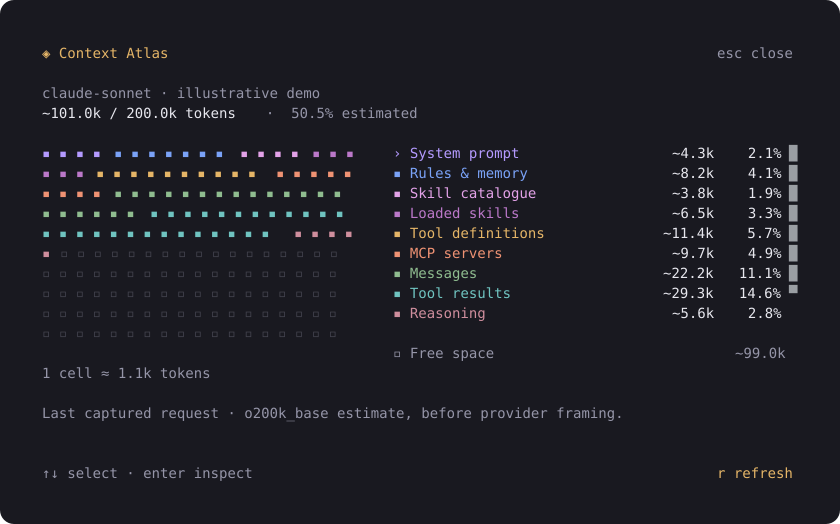
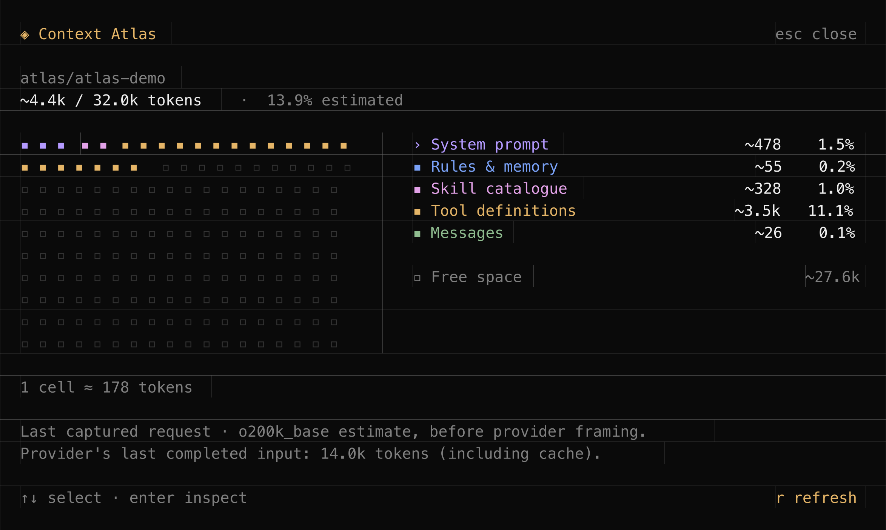
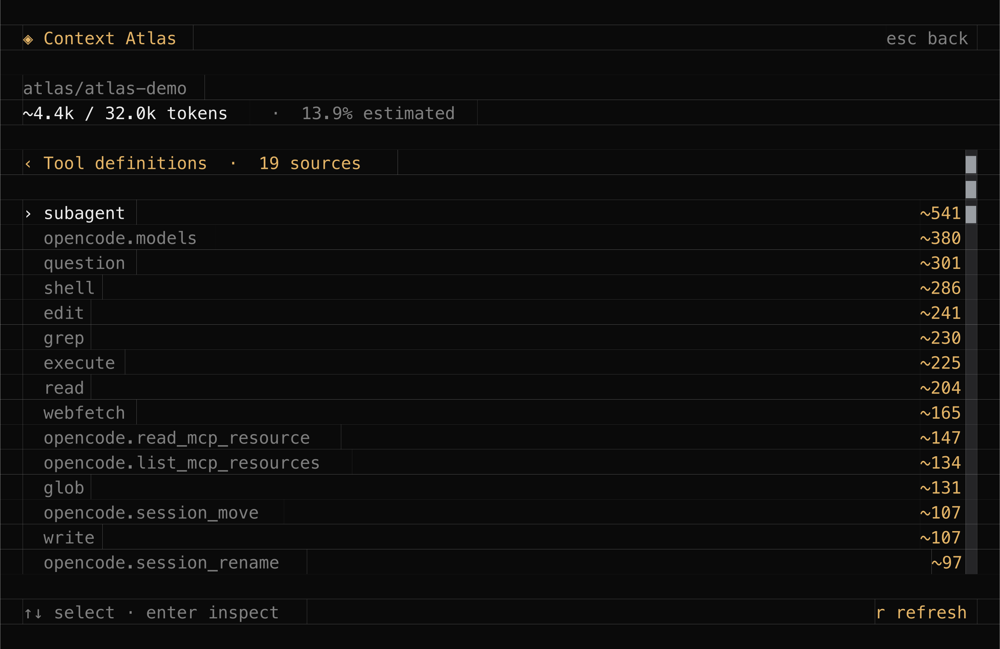
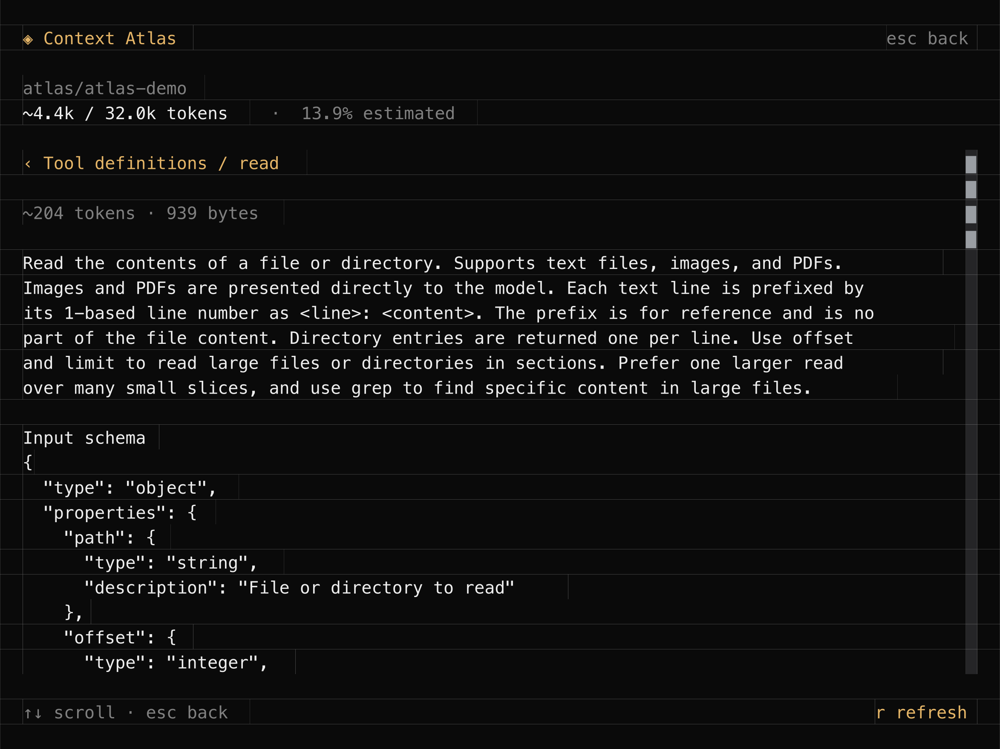

# Context Atlas

A Claude Code-inspired **context map for OpenCode v2**. See what occupies your
context window, then drill into the actual rules, skills, tool definitions and
messages behind the numbers.



<details>
<summary>Frames from a running OpenCode 2.0.22 demo</summary>

These are cropped framebuffer exports from the live TUI, rasterized to PNG;
they are not macOS window captures. The local fixture provider supplies the demo
conversation and illustrative provider usage.





</details>

## Open it

- **`/context`**, or **`/atlas`** — open the inspector for the current session.
- **Click `Atlas ↗`** in the sidebar — open the same inspector.
- Click a colored cell or a category, or use **↑/↓ and Enter**, to inspect its sources.
- Select a source to read its captured text. **Esc** goes back, then closes.
- **`r`** refreshes. Long lists and source previews scroll; narrow terminals stack
  the map above the legend.

The command is a local TUI action. Opening the inspector does not send a prompt
or make a model call.

## Install

Requires **OpenCode v2, version 2.0.22 or newer** (tested with 2.0.22).
OpenCode 1 is not supported.

### Quick install — no Node.js required

```sh
curl -fsSL https://raw.githubusercontent.com/LerikP/opencode-context-atlas/main/install.sh | sh
```

The shell installer finds a compatible `opencode` or `opencode2` executable and
uses OpenCode's built-in package installer. You do **not** need to install Node.js,
npm or Bun separately. OpenCode fetches the plugin and its dependencies and adds
it to the global configuration. Repeating the command does not duplicate the entry.

For an OpenCode executable outside `PATH`:

```sh
curl -fsSL https://raw.githubusercontent.com/LerikP/opencode-context-atlas/main/install.sh |
  OPENCODE_BIN=/absolute/path/to/opencode-v2 sh
```

You can also invoke the underlying command directly:

```sh
opencode plugin add github:LerikP/opencode-context-atlas
```

### Install from a checkout — development

This option needs Node.js/npm for dependency installation:

```sh
git clone https://github.com/LerikP/opencode-context-atlas.git
cd opencode-context-atlas
npm ci
```

For a checkout installation, add the **absolute checkout path** to `plugins` in your OpenCode v2
`opencode.json` or `opencode.jsonc`. This loads the server capture hook and the TUI
entry point together:

```jsonc
{
  "$schema": "https://opencode.ai/config.json",
  "plugins": ["/absolute/path/to/opencode-context-atlas"]
}
```

### Sidebar indicator

For either installation method, to replace the built-in sidebar context indicator, add this directive to your
global **`cli.json`** (usually `~/.config/opencode/cli.json`):

```jsonc
{
  "$schema": "https://opencode.ai/v2/cli.json",
  "plugins": ["-opencode.sidebar.context"]
}
```

Merge these entries with your existing configuration. Restart OpenCode and send
one message to capture a request. Atlas keeps snapshots in memory, so a server
restart or eviction requires another request in that session.

For a remote server, install the server entry there and configure this package
in the client's `cli.json` as well. Atlas's RPC retrieves the snapshot from the
server; it does not assume a shared filesystem. Remote deployment has not yet
been exercised end to end.

## What is counted

| Category | Contents |
| --- | --- |
| System prompt | Base instructions and environment text |
| Rules & memory | `Instructions from:` blocks, including AGENTS.md |
| Skill catalogue | Names/descriptions advertised to the model |
| Loaded skills | Skill bodies present in tool results |
| Tool definitions | Native schemas and advertised Code Mode tool signatures |
| MCP servers | Definitions attributed to configured MCP namespaces and MCP instructions |
| Messages | User/assistant text and tool-call inputs |
| Tool results | Text/JSON results replayed into the current request |
| Reasoning | Replayed reasoning text |
| Other | Overflow of the bounded source list |

Categories are disjoint: a loaded skill is not charged again to tool results.
Installed skills and connected MCP servers are not counted merely for existing.
For Code Mode, only the advertised portion of the catalogue is counted.

### Accuracy

**The map and every `~` figure are estimates.** Atlas captures the assembled
`session.context` request and counts its textual parts with `o200k_base`.
This works without intercepting provider traffic, including WebSocket-backed
sessions. It is not the provider's tokenizer/framing contract, and attribution
of instruction blocks relies on OpenCode's prompt markers.

The provider's last completed input usage, including cache, is shown separately.
It can differ from the captured request estimate, especially during a running
turn. Atlas does not rescale category counts to make them look exact. The map
describes the **last captured request**, not a prediction of the next one.

Media, files embedded in tool results, and opaque provider state cannot be
measured as ordinary text. Unsupported content parts produce coverage notes.
Unknown model limits, missing captures and failed requests are shown explicitly.
Provider-side compaction can make the server-side text estimate differ
substantially from actual window occupancy.

### Storage

Atlas holds at most eight session snapshots in memory. Each source preview is
limited to 8 KiB, and each snapshot to 128 KiB of preview text; full source text
is counted before truncating previews. It never writes prompt text to disk,
logs it, or sends it to another service. The inspector deliberately exposes the
captured source text to the local user.

## Development

Use Node.js 22+ and Bun (tested with Bun 1.4.2):

```sh
npm ci
npm run typecheck
npm test
npm run preview
```

`test:core` checks attribution, token conservation, bounded previews, session
isolation, grid allocation and the shell installer (with Node.js/npm/Bun absent
from the installer's `PATH`). `test:tui` uses the real OpenTUI renderer for
keyboard navigation, mouse inspection, resizing, refresh and session switching.

### Isolated OpenCode demo

Point `OPENCODE_V2_BINARY` at an OpenCode 2.0.22 executable, then:

```sh
OPENCODE_V2_BINARY=/absolute/path/to/opencode-v2 npm run demo
```

The development launcher creates a separate HOME/XDG configuration under
`.dev/runtime`, disables external compatibility skill discovery, and serves a
deterministic model on loopback. It seeds a session with that model explicitly,
then launches the TUI. Its provider usage is illustrative fixture data.
The launcher writes **fixture-only** request data under `.dev/` for debugging;
this behavior belongs to the demo provider, not the plugin.

The local default binary path is
`../opencode-v2-context-atlas/node_modules/@opencode/cli-darwin-arm64/bin/opencode`.
No shell profile or normal OpenCode installation is modified.

An agterm smoke probe can exercise an explicitly addressed demo terminal:

```sh
npx tsx dev/verify-agterm.ts <session-id> <window-id>
```

In the isolated demo, **Ctrl+G** exports the visible Atlas dialog to
`.dev/capture-N.svg` using OpenTUI's own framebuffer. This development-only
capture plugin is excluded from the installable package and never loads in a
normal installation.

See [DESIGN.md](DESIGN.md) for module boundaries and accounting decisions.

## License

MIT.
